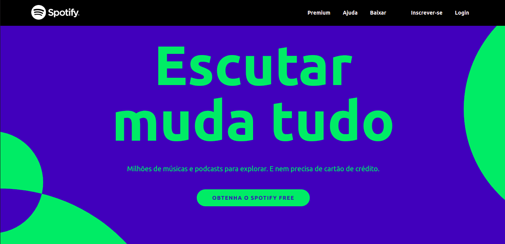
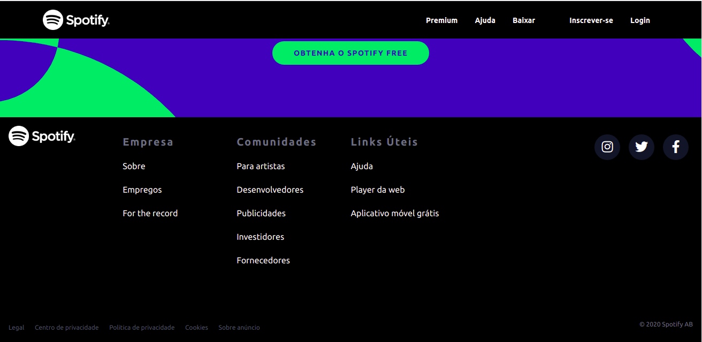

# Clone do Spotify 
[](https://github.com/devsuperior/sds1-wmazoni/blob/master/LICENSE) 

# Sobre o projeto

Clone do Spotify para treinar conhecimentos com TailwindCSS.

## Layout mobile
 

## Layout web





# Tecnologias utilizadas
## Front end
- HTML 
- TailwindCSS

# Como executar o projeto

## Front end web
Pré-requisitos: npm / yarn

```bash
# clonar repositório
git clone https://github.com/LuanPetruitis/clone-spotify.git

# entrar na pasta do projeto front end web
cd clone-spotify

# instalar dependências
npm install

# executar o projeto
Executar a extensão live-server
```

# Autor

Luan Rodrigues Petruitis

https://www.linkedin.com/in/luanpetruitis/
